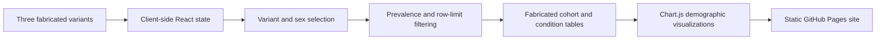

# System Architecture and Design Decisions

## Purpose

The All of Us Rare Variant Genotype-Phenotype Explorer converts a repeated genomic and clinical analysis into a guided workflow for researchers who may not routinely write SQL.

The production system operates inside the NIH All of Us Researcher Workbench. The public GitHub Pages version reproduces the interface using fabricated data and has no connection to the All of Us Controlled Tier.

## Design goals

The system was designed to:

- Replace custom SQL written separately for each variant
- Make rare-variant phenotype exploration accessible to nonprogrammers
- Preserve the analytical settings that shape interpretation
- Reduce redundant cloud queries and wait time
- Produce outputs that are easier to interpret during research meetings
- Remain compatible with All of Us privacy and dissemination requirements
- Fit into an existing rare-disease candidate-gene workflow

## Production architecture

```mermaid
flowchart LR
    A[Variant ID in hg38 format] --> B{Raw variant cache}
    B -->|Cache miss| C[Identify WGS carrier cohort]
    C --> D[Query demographic and OMOP condition data in BigQuery]
    D --> E[Cache raw query results by variant]
    B -->|Cache hit| E
    E --> F{Processed-output cache}
    F -->|Cache miss| G[Apply sex filter]
    G --> H[Apply temporal deduplication]
    H --> I[Apply condition-frequency threshold]
    I --> J[Apply cohort-prevalence cutoff]
    J --> K[Calculate events, unique individuals, and prevalence]
    K --> L[Cache output by complete parameter set]
    F -->|Cache hit| L
    L --> M[Render Jupyter tables and visualizations]
```

## Production environment

The production implementation operates within the All of Us Researcher Workbench and uses:

- Controlled Tier participant data
- Whole-genome sequencing variant information
- Demographic data
- OMOP-formatted condition occurrence records
- Google BigQuery
- An interactive Jupyter-based user interface
- Workbench authentication and access controls

No participant-level production data are included in the public repository.

## End-to-end production flow

### 1. Variant input

The researcher enters a variant using hg38 `chr-pos-ref-alt` notation.

The system identifies participants carrying the selected variant within the available whole-genome sequencing cohort.

### 2. Raw data retrieval

Carrier identifiers are connected to demographic information and OMOP condition occurrence records in BigQuery.

The raw retrieval stage is intentionally separated from downstream analysis because the cloud query is the most expensive and slowest part of the workflow.

### 3. Raw-query caching

Raw query results are cached by variant.

When a researcher changes a downstream filter or display setting without changing the variant, the tool can reuse the retrieved data instead of repeating the BigQuery query.

### 4. Parameterized processing

The retrieved records are processed according to the complete analysis configuration, including:

- Sex-at-birth filter
- Minimum condition frequency
- Temporal deduplication window
- Cohort-prevalence cutoff
- Output row settings

### 5. Processed-output caching

Fully processed outputs are cached by the complete parameter set.

This means that:

- Repeated configurations can return immediately.
- Different configurations remain analytically distinct.
- Display experimentation does not automatically trigger cloud retrieval.
- Iteration during research meetings is faster and less expensive.

### 6. Aggregation

The processing layer calculates:

- Full and filtered carrier counts
- Condition occurrence counts
- Unique individuals affected
- Percentage of the filtered cohort affected
- Participant-level event summaries
- Demographic distributions

### 7. Presentation

The outputs are presented through the interactive Jupyter dashboard as:

- Cohort summary cards
- Ranked condition tables
- Individual-level review tables
- Race, ethnicity, and sex-at-birth summaries
- A visible record of the selected analysis settings

## Why two cache layers are necessary

A single cache would not cleanly distinguish data retrieval from analytical transformation.

### Variant-level raw cache

The variant-level cache is appropriate because the same carrier and clinical records may support many combinations of downstream filters.

### Parameter-level processed cache

The parameter-level cache is appropriate because changing a temporal window, frequency threshold, or prevalence cutoff changes the analytical result even when the underlying retrieved records remain the same.

Separating the caches therefore improves:

- Correctness
- Query efficiency
- Cloud cost
- Responsiveness
- Reproducibility
- User experience

## Analytical design decisions

### Separate events from affected individuals

Multiple condition records may refer to the same participant.

The dashboard reports both total occurrences and unique individuals so repeated documentation is not mistaken for broader cohort prevalence.

### Expose analytical choices

Frequency thresholds, temporal windows, sex stratification, and prevalence cutoffs are visible controls rather than hidden query assumptions.

This allows researchers to understand which choices produced the output.

### Support temporal deduplication

Repeated diagnosis records within a defined time window can be collapsed before aggregation.

This reduces the risk of interpreting repeated documentation of one clinical episode as multiple independent events.

### Preserve cohort context

The interface keeps both full and filtered cohort counts visible so the effect of filtering decisions remains interpretable.

### Optimize for meetings and iterative analysis

The interface and caching layers were designed to support repeated exploration without requiring new code or unnecessary cloud queries each time a research question changes.

## Privacy and dissemination architecture

All of Us dissemination rules require suppression of aggregate counts from 1 through 20 and also prohibit reporting values from which those counts can be derived.

The production system remains inside the Controlled Tier. External reporting requires a separate dissemination review and may require:

- Collapsing categories
- Coarsening bins
- Suppressing values
- Removing indirectly derivable statistics

The public demonstration avoids participant privacy risk by using entirely fabricated variants, records, counts, and distributions.

## Public demonstration architecture

The public demonstration:

- Runs entirely in the browser
- Uses no server or database
- Contains no All of Us participant data
- Uses three fabricated variants and synthetic cohorts
- Applies variant, sex, prevalence, and row-limit controls
- Displays frequency and temporal controls for production-interface fidelity
- Does not execute production frequency or temporal logic
- Does not query BigQuery
- Does not include the production cache implementation

## Production and public-version boundaries

| Layer | Production | Public demonstration |
|---|---|---|
| Interface | Jupyter-based dashboard | React in a static HTML file |
| Genomic source | Controlled Tier WGS variant data | Fabricated variant selection |
| Clinical source | OMOP condition records in BigQuery | Hardcoded synthetic objects |
| Authentication | Researcher Workbench | None |
| Raw-query cache | Variant-keyed | Not applicable |
| Processed-output cache | Complete parameter set | Not applicable |
| Temporal deduplication | Implemented | Inactive |
| Frequency threshold | Implemented | Inactive |
| Sex filter | Implemented | Implemented |
| Prevalence cutoff | Implemented | Implemented |
| Individual rows | Governed participant data | Fabricated |
| Deployment | Secure All of Us environment | GitHub Pages |

## Why the public version uses a single HTML file

The demonstration was designed to be:

- Easy to open
- Easy to inspect
- Easy to share
- Free of backend configuration
- Explicitly synthetic
- Independent of inaccessible services

A single-file implementation is appropriate for that demonstration goal. It is not presented as the architecture of the production analytical system.

## Role in the rare-disease workflow

The tool complements other evidence used during candidate-gene evaluation, including:

- Allele frequency
- Inheritance pattern
- Clinical classifications
- Transcript expression
- Pathogenicity predictions
- Literature evidence
- Ortholog and model-organism evidence

Its role is to provide condition-count and phenotype-profile evidence from an external genomic and clinical cohort.

## Future extensions

### HPO mapping and summarization

Map condition findings into Human Phenotype Ontology terms and explore privacy-compliant summarization of the output.

### Zygosity

Add homozygous and heterozygous classifications to carrier analysis.

### SpliceAI

Add splicing predictions to the evidence available during variant review.

### Continuous phenotypes

Compare continuous measures such as height and weight between reference and variant genotypes.

## Production considerations

Continued production use requires:

- Compliance with All of Us data-use and dissemination policies
- Controlled Tier authentication and authorization
- Query-cost monitoring
- Cache invalidation rules
- Reproducible parameter logging
- Validation of temporal-deduplication assumptions
- Clear cohort-denominator definitions
- Monitoring for changes in OMOP concepts and source-data availability
- User testing with clinical researchers
- Documentation of intended and unintended use

## Credit

**Development:** Gabriel Kettering

**Scientific supervision:** Dustin Baldridge, MD, PhD

**Dashboard-format concept:** RJ Waken, PhD

The system was independently designed and developed by Gabriel Kettering under scientific supervision from Dr. Baldridge. Dr. Waken's initial suggestion of a dashboard format helped shape the project's direction.
