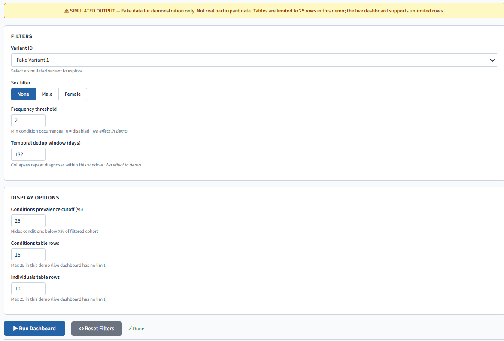
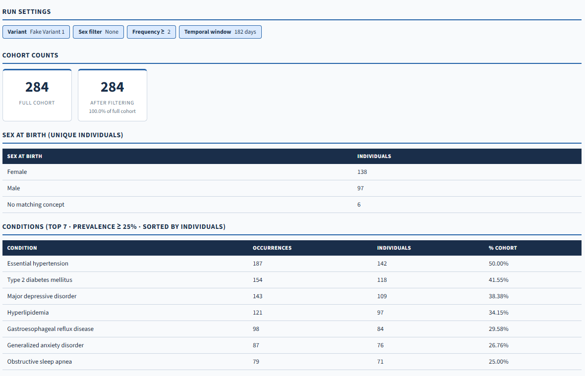
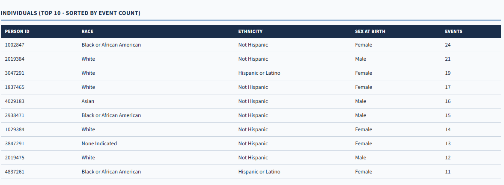
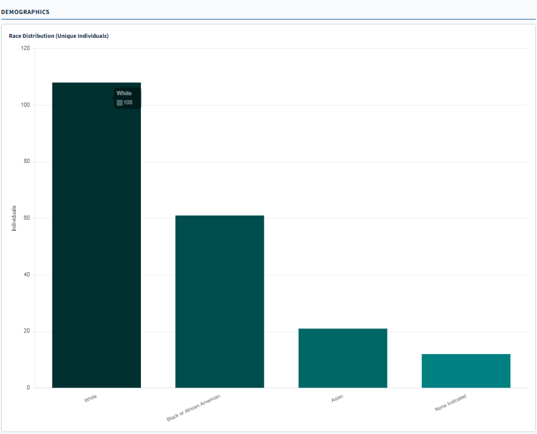
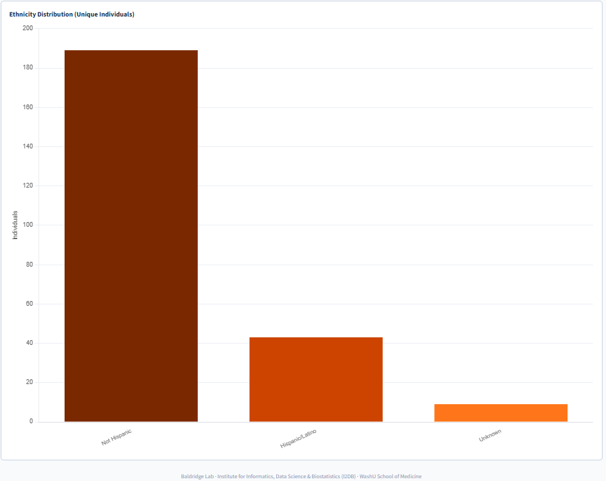

# All of Us Rare Variant Genotype-Phenotype Dashboard (Demo)

A no-code interface for exploring rare variant phenotype profiles across the NIH All of Us Research Program cohort. Built at the Baldridge Lab (WashU Medicine, I2DB) so clinical researchers can query genotype-phenotype relationships without writing SQL, and presented as a poster at the I2DB symposium.

**Live demo:** https://ketteringg.github.io/All-of-Us-Dashboard-Demo/




#


## Why this repo exists

This README is written for two audiences at once: recruiters and hiring managers looking at code samples, and people who scanned the QR code off the poster and want to try the tool themselves. Either way, the goal is to show what the real internal dashboard does without requiring All of Us Controlled Tier access to see it.

## What's different from the real tool

The dashboard that runs against live data lives inside the All of Us Researcher Workbench and cannot be shown publicly, since Controlled Tier data is not permitted to leave that secure environment under the program's data use policy. This public version is a faithful reproduction of the interface and interaction logic, running against fabricated data instead:

| | Internal version | This public demo |
|---|---|---|
| Data source | Live BigQuery query against All of Us Controlled Tier | Three hardcoded fake variants with fabricated cohorts |
| Participant counts | Real, drawn from 875,000+ participants | Invented (156 to 412 per fake variant) |
| Authentication | Required, workbench-gated | None, fully public |
| Table row limits | None | Capped at 25 rows per table |
| Filtering logic | Fully functional | Fully functional (same code path, fake inputs) |

Everything you can click, filter, and run here behaves exactly like the real thing (with the exception of the temporal and frequency filters, which have no effect in the demo). Only the data underneath it is fake.

## What it does

A researcher with no programming background can:

- Select a variant of interest and filter carriers by sex at birth
- Set a condition-frequency threshold to surface phenotypes enriched in the carrier cohort
- Apply a temporal deduplication window to collapse repeat diagnosis codes into single events
- View demographic breakdowns (race, ethnicity, sex) alongside condition prevalence tables
- Drill into individual-level records, within the bounds of Controlled Tier data governance in the real version

## Why it was built

Rare variant phenotype analysis in All of Us normally means writing BigQuery SQL against the OMOP-formatted EHR tables and joining that against WGS variant calls. That's a real barrier for clinical researchers and genetic counselors who understand the biology but not the query layer. This dashboard turns that workflow into a set of filters and a "Run" button, while keeping the parts that matter for research rigor. Condition frequency thresholds, temporal dedup logic, and colorblind-safe visualizations were all specifically requested by the clinical team using it.

## Tech stack

Single file, dependency light, no build step and no bundler:

- React 18 (UMD build, loaded via CDN)
- Babel Standalone for in-browser JSX transpilation
- Chart.js 4 for the demographic bar charts
- Plain CSS custom properties for theming, no framework

The production version, which isn't in this repo, queries Google BigQuery against the All of Us Controlled Tier and adds authentication in front of the same interface.

## Running locally

No install required:

```bash
git clone https://github.com/ketteringg/All-of-Us-Dashboard-Demo.git
cd All-of-Us-Dashboard-Demo
open index.html   # or just double-click it
```

Everything runs client-side in the browser. There's no server component in this demo.

## Related work

This dashboard is one piece of a broader rare variant analysis pipeline built at the Baldridge Lab. That pipeline also includes an automated variant annotation tool integrating gnomAD, ClinVar, Ensembl VEP, OMIM, Monarch Initiative, GTEx, and local SpliceAI predictions. That same tool now supports Model Organism Screening Center (MOSC) submission triage, helping investigators judge whether a candidate gene has enough population, clinical, and ortholog evidence to justify functional validation. See [ketteringg](https://github.com/ketteringg) for more repositories.

## Authors

Gabriel Kettering, Caitlyn Chitwood, Dustin Baldridge. Baldridge Lab, Institute for Informatics, Data Science & Biostatistics (I2DB), WashU School of Medicine.

## License

MIT. See [LICENSE](./LICENSE).
