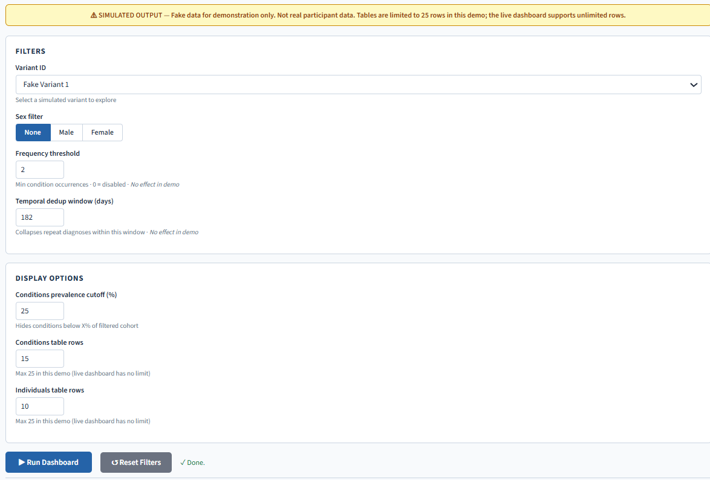
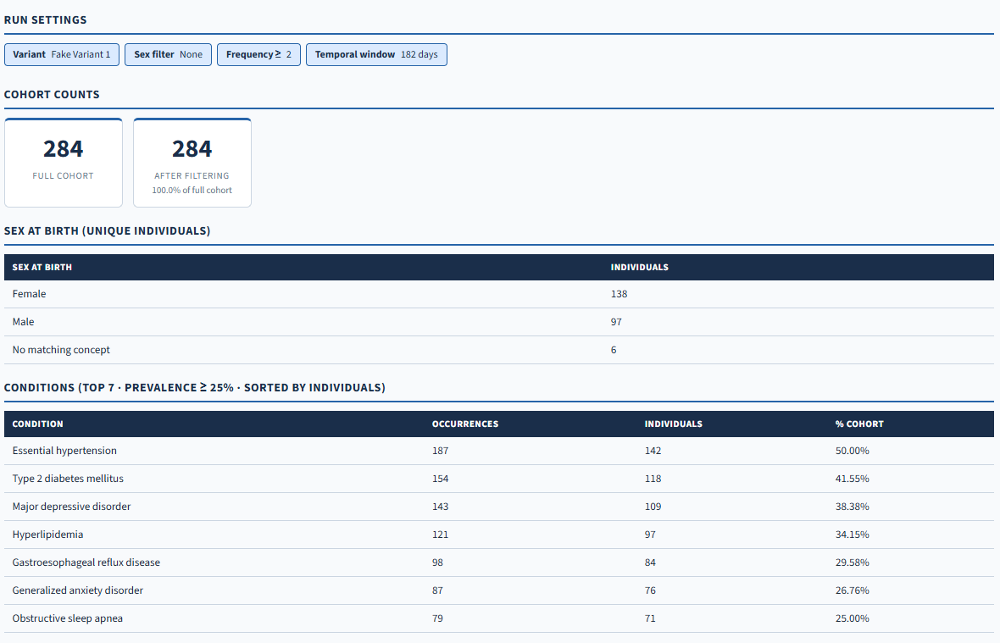
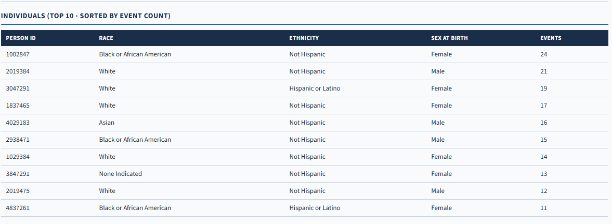
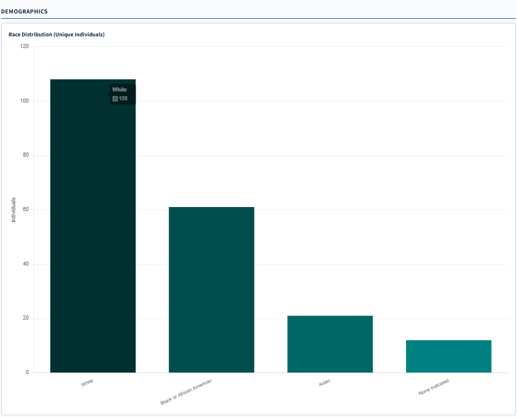
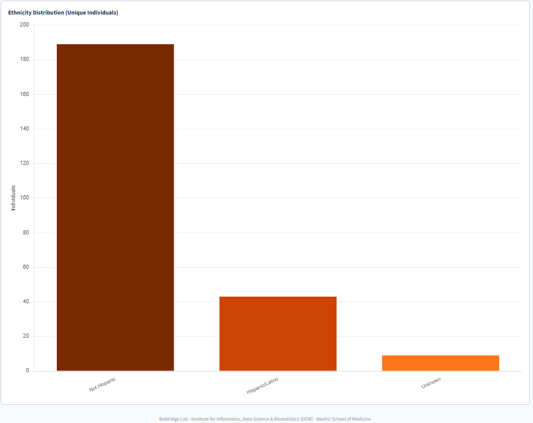

# All of Us Rare Variant Genotype-Phenotype Explorer

A no-code research tool that enables clinical researchers to explore phenotype patterns among carriers of rare genetic variants in the NIH All of Us Research Program without writing SQL.

The central challenge was not simply retrieving genomic and clinical data. It was replacing a repeated, technically burdensome analysis process with a reusable system that preserved the analytical choices, privacy constraints, and outputs needed for scientific interpretation.

Built in the Baldridge Lab at Washington University School of Medicine and presented as a poster at the Institute for Informatics, Data Science and Biostatistics symposium.

**My role:** I independently designed and developed the project end to end under the scientific supervision of Dustin Baldridge, MD, PhD. I defined the workflow and technical priorities; built the production BigQuery and OMOP analysis pipeline, two-layer caching architecture, filtering and aggregation logic, interactive Jupyter application, and visualizations; created the synthetic public demonstration; and prepared the project for presentation. The initial suggestion to present the analysis as a dashboard came from RJ Waken, PhD, and helped shape the project's direction.

## Project links

- **Live public demonstration:** [Open the genotype-phenotype explorer](https://ketteringg.github.io/All-of-Us-Dashboard-Demo/)
- **System architecture:** [Review the production and public-demo design](./ARCHITECTURE.md)

The demonstration runs directly in a browser. No installation or All of Us account is required.

> **All variants, participant records, cohort counts, and clinical information displayed in the public demonstration are fabricated.** No All of Us participant-level data, protected health information, or actual population trends are included in this repository.



## The research problem

Understanding which health conditions may be associated with a specific rare genetic variant remains an important challenge in clinical genetics.

Within our existing workflow, investigating a new candidate variant required writing custom database queries, joining whole-genome sequencing carrier information to longitudinal clinical records, applying analytical filters, and converting dense outputs into something the research team could interpret.

This created several problems:

- Each new variant required another round of custom coding.
- The workflow was inaccessible to team members without programming experience.
- Dense static outputs took time to interpret during meetings.
- Meeting time was spent digesting results rather than deciding on next actions.
- Findings were difficult to aggregate and share while preserving usefulness for very rare variants.

The project converts that process into a reusable point-and-click workflow so researchers can spend less time reconstructing the analysis and more time interpreting the evidence.

## Where the tool fits

The dashboard supports rare-disease candidate-gene analysis within the broader Undiagnosed Diseases Network workflow.

After a candidate variant is identified, investigators may evaluate evidence including:

- Population allele frequency
- Inheritance pattern
- Clinical variant classifications
- Transcript expression
- Pathogenicity predictions
- Literature evidence
- Conditions observed among variant carriers

This tool supplies the genotype-phenotype component by identifying variant carriers in All of Us and summarizing their linked clinical condition records.

## Production data and environment

The production system operates inside the NIH All of Us Researcher Workbench and uses:

- All of Us Controlled Tier access
- Whole-genome sequencing variant data
- Demographic information
- OMOP-formatted condition occurrence records
- Google BigQuery
- An interactive Jupyter-based dashboard

The user enters a variant in hg38 `chr-pos-ref-alt` format and configures the analysis through point-and-click controls.

No participant-level production data or Controlled Tier query outputs are included in this public repository.

## Production analysis workflow

For each queried variant, the production tool:

1. Identifies participants carrying the variant within the available whole-genome sequencing cohort.
2. Applies optional sex-at-birth stratification.
3. Joins the carrier cohort to OMOP condition occurrence records in BigQuery.
4. Collapses repeated diagnoses within a configurable temporal window.
5. Applies a minimum condition-frequency threshold.
6. Removes conditions below a selected cohort-prevalence cutoff.
7. Separates total condition occurrences from unique individuals affected.
8. Generates cohort, condition, individual-level, and demographic outputs.
9. Returns the results through an interactive no-code interface inside the secure Researcher Workbench.

## Two-layer caching architecture

The production tool separates cloud data retrieval from downstream processing.

### Raw-query cache

Raw BigQuery results are cached by variant.

This prevents the system from repeating the same cloud query whenever a researcher changes a downstream filter or display option.

### Processed-output cache

Fully processed outputs are cached using the complete set of pipeline parameters.

This allows repeated parameter combinations to return quickly while ensuring that distinct analytical settings produce distinct cached results.

Together, the two layers reduce:

- Redundant cloud queries
- BigQuery compute costs
- Waiting time
- Repeated processing
- Friction during iterative exploration

The caching design reflects the intended workflow: researchers should be able to adjust analytical choices during a meeting without unnecessarily repeating the most expensive stage of the pipeline.

## Analytical controls

### Sex-at-birth stratification

Researchers can stratify the carrier cohort by sex at birth, including for analyses involving X chromosome variants.

### Minimum condition frequency

A minimum frequency threshold can be applied to focus the output on conditions occurring often enough to be useful for the current analysis.

### Temporal deduplication

Repeated diagnoses within a configurable number of days can be collapsed so repeated documentation of one clinical episode is not automatically interpreted as multiple independent events.

### Cohort prevalence cutoff

Conditions affecting less than a selected percentage of the filtered carrier cohort can be hidden from the displayed output.

### Display controls

Researchers can control the number of rows shown in condition and individual-level tables without changing the underlying analytical cohort.

## Why event counts and participant counts are separated

A participant may have the same diagnosis recorded multiple times.

Reporting only condition occurrences can therefore make a condition appear more broadly distributed across a cohort than it actually is.

The tool distinguishes:

- Total condition occurrences
- Unique individuals with the condition
- Percentage of the filtered carrier cohort affected

This makes repeated documentation visible without confusing record volume with participant prevalence.

## Privacy and dissemination safeguards

All of Us dissemination rules prohibit publishing aggregate counts from 1 through 20. Values from which suppressed counts could be derived through percentages, formulas, or combinations of cells must also be protected.

Depending on the output, compliant strategies may include:

- **Collapse:** combine adjacent categories until the resulting count is publishable.
- **Coarsen:** widen the granularity of a category or bin.
- **Suppress:** replace the value with an approved suppressed-count representation.

The production analysis remains inside the Controlled Tier. Any result intended for external sharing must be reviewed and transformed according to the applicable All of Us dissemination requirements.

The public demonstration avoids this risk entirely by using fabricated records and synthetic cohort summaries.

## Pipeline outputs

For each queried variant, the production dashboard generates:

### Cohort summary

- Full carrier cohort count
- Filtered cohort count
- Sex-at-birth breakdown

### Conditions table

- Condition name
- Total recorded occurrences
- Unique individuals affected
- Percentage of the filtered cohort affected
- Ranking by individuals affected

### Individuals table

- Participant-level condition event counts
- Associated demographic fields available within the governed environment

### Demographic visualizations

- Race distribution
- Ethnicity distribution
- Sex-at-birth distribution

## Production tool versus public demonstration

| Capability | Production tool | Public demonstration |
|---|---|---|
| Environment | All of Us Researcher Workbench | Public GitHub Pages site |
| Interface | Interactive Jupyter application | React interface running in the browser |
| Data source | BigQuery queries against Controlled Tier WGS, demographic, and OMOP EHR data | Three fabricated variants with synthetic cohorts |
| Variant input | hg38 variant identifier | Selection among three fabricated variants |
| Authentication | Researcher Workbench access controls | Public |
| Sex filter | Functional | Functional |
| Condition-prevalence cutoff | Functional | Functional |
| Table row controls | Functional | Functional, capped at 25 rows |
| Frequency threshold | Functional | Shown for interface fidelity but inactive |
| Temporal deduplication | Functional | Shown for interface fidelity but inactive |
| Individual-level records | Governed participant data within the Controlled Tier | Entirely fabricated |
| Query execution | Live BigQuery execution with two-layer caching | No backend query; all data run locally in the browser |

The public version demonstrates the user workflow and active client-side interactions. It does not reproduce the production BigQuery, caching, frequency-threshold, or temporal-deduplication logic.

## Public demonstration implementation

The public demonstration uses:

- React 18
- Babel Standalone
- Chart.js 4
- JavaScript
- HTML
- CSS custom properties
- GitHub Pages

It is intentionally dependency-light and contained in a single HTML file. This allows reviewers to inspect and run the demonstration without configuring a backend or trusting an inaccessible service.

## Repository structure

```text
.
├── index.html                  # public React demonstration and synthetic data
├── README.md                   # project overview and documentation
├── ARCHITECTURE.md             # production and public-demo system design
├── Dashboard.png               # primary interface view
├── Cohort_&_Conditions.png     # cohort and phenotype tables
├── Individuals_Table.png       # fabricated individual-level records
├── Demographics.png            # demographic visualization
└── Ethnicity.png               # ethnicity visualization
```

## Interface views

### Cohort and condition summaries



### Individual-level review



### Demographic distributions





## Running the public demonstration locally

No installation or build process is required.

```bash
git clone https://github.com/ketteringg/All-of-Us-Dashboard-Demo.git
cd All-of-Us-Dashboard-Demo
open index.html
```

The file can also be opened directly in a browser.

Everything in the public version runs client-side. There is no server component, external database connection, or participant-level data.

## Future directions

Potential extensions identified during the project include:

### HPO terms and privacy-compliant AI summarization

Map clinical findings to Human Phenotype Ontology terms and explore a closed-loop summarization workflow that remains compliant with All of Us data-sharing restrictions.

### Zygosity classification

Add homozygous and heterozygous classification to the variant-analysis workflow.

### SpliceAI integration

Incorporate variant splicing predictions into the evidence presented alongside carrier phenotypes.

### Continuous phenotypes

Compare measurable continuous phenotypes, such as height or weight, between reference and variant genotypes.

## Related work

This dashboard is one component of a broader rare-variant analysis workflow I developed in the Baldridge Lab.

Related work includes an automated variant-annotation and qualification system integrating:

- gnomAD
- ClinVar
- Ensembl Variant Effect Predictor
- OMIM
- Monarch Initiative
- GTEx
- Local SpliceAI predictions

That system also supports Model Organism Screening Center submission triage by helping investigators assess population, clinical, functional, and ortholog evidence for candidate genes.

## Limitations

This repository is a public demonstration of a research tool, not the production All of Us implementation.

Important limitations include:

- All displayed variants, records, counts, and distributions are fabricated.
- The public version does not query Google BigQuery.
- The public version does not contain the production caching implementation.
- Frequency-threshold and temporal-deduplication controls are inactive in the public demonstration.
- Synthetic cohort sizes and phenotype distributions do not represent the All of Us population.
- Individual-level tables are limited to 25 fabricated rows.
- The repository does not contain production SQL or Controlled Tier data.
- Results produced by the internal tool still require scientific interpretation and appropriate validation.

## Project context and credit

**Development:** Gabriel Kettering

**Scientific supervision:** Dustin Baldridge, MD, PhD, Baldridge Lab, Washington University School of Medicine

**Dashboard-format concept:** RJ Waken, PhD

**Poster authors:** Gabriel Kettering, Caitlyn Chitwood, and Dustin Baldridge

I independently designed and developed the end-to-end analytical system through regular consultation and scientific supervision from Dr. Baldridge. Dr. Waken's initial suggestion of a dashboard format helped shape the project's direction.
